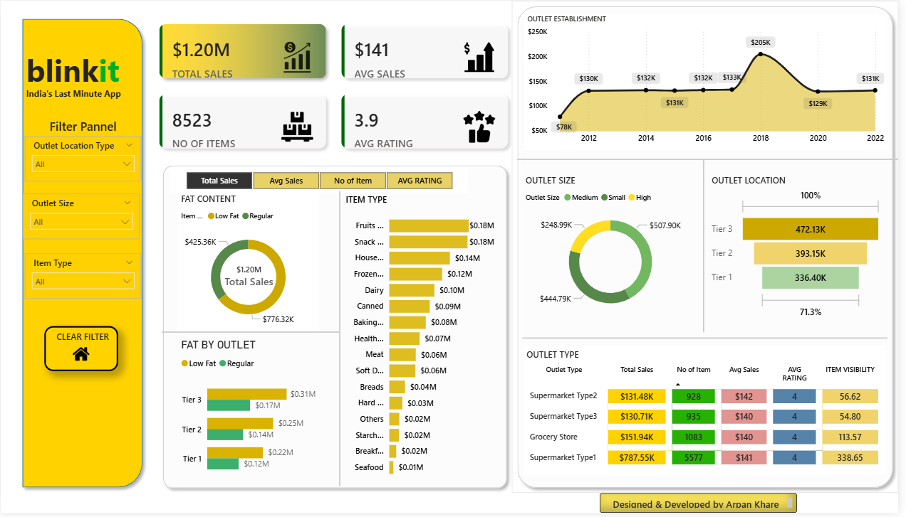

# 🛒 Blinkit Sales Dashboard – Power BI Project

Welcome to my Blinkit-inspired **Power BI dashboard** — a visually rich, interactive report that provides insights into sales, outlet types, product categories, customer ratings, and more.

This dashboard is designed to reflect the data-driven decision-making needs of a modern retail company, using a clean, brand-aligned design.

---

## 🖼️ Dashboard Preview



---

## 📌 What This Dashboard Shows

This report gives you a comprehensive view of:

- **Total Sales** across different item types and outlet types.
- **Number of Items** sold in each category.
- **Average Rating** per outlet and item.
- **Item Type Distribution** (Fruits, Snacks, Dairy, etc.)
- **Outlet Establishment Trends** (Year-wise)
- **Outlet Size & Location Analysis**
- **Fat Content vs Outlet Tier**
- **Custom filtering experience with a Clear Filter button**

---

## 🎯 Why I Built This

This dashboard was built to:

- Demonstrate skills in **data visualization**, **storytelling**, and **Power BI interactivity**.
- Practice **UI/UX design** within Power BI using real-world branding (Blinkit).
- Showcase how retail businesses can gain value from dashboards like these.
- Learn how to replace **bookmarks with clean navigation** using buttons and filters.

---

## 🧩 Key Features

| Feature | Description |
|--------|-------------|
| 🔘 **Clear Filter Button** | Resets all slicers at once using a custom icon. |
| 📊 **Cards & KPIs** | Total Sales, No. of Items, Average Sales, and Ratings. |
| 📅 **Line Chart** | Yearly trend of outlet establishment. |
| 🍩 **Donut Charts** | Visual split by fat content and outlet size. |
| 📍 **Bar Graphs** | Fat by Outlet, Item Type, and Outlet Location. |
| 🧮 **Matrix Table** | Sales, items, rating, and visibility by outlet type. |
| 🎨 **Theming** | Matches Blinkit's yellow-black brand identity. |

---

## 💼 Business Scenario (Use Case)

Imagine Blinkit wants to understand:

- Which **tier cities** or **outlet sizes** contribute most to their revenue?
- What types of items sell best?
- Which outlet types have the **best average rating**?
- How many items are listed per outlet?
- What’s the visibility and reach of different outlet categories?

This dashboard answers all of that — at a glance.

---

## 🔧 How to Use

1. Download or clone this repo.
2. Open `BlinkitDashboard.pbix` in **Power BI Desktop**.
3. Use the **slicers** on the left to filter by:
   - Outlet Location Type
   - Outlet Size
   - Item Type
4. Click the **Clear Filter (Home) button** to reset all filters.
5. Explore interactive visuals, tables, and ratings.

---

## 🧠 Skills Demonstrated

- Power BI Desktop (DAX, visual layout, filter context)
- Visual storytelling and theme alignment
- Use of **buttons instead of bookmarks**
- Data organization and visual hierarchy
- UI/UX design for dashboard navigation

---

## 📁 Project Structure
```
├── BlinkitDashboard.pbix # Main Power BI report file
├── README.md # Project documentation
├── images/
│ └── dashboard-preview.png # Screenshot used in README
└── data/ # (Optional) Sample or raw data files
```

